# BT Web Studio 工作流重构设计

## 概述

本文档详细描述了 BT Web Studio 的工作流重构设计，将原本散乱的三个核心功能（编排、调试加状态可视化、日志回放）重构为三种清晰的工作模式：**编排模式**、**调试模式**、**回放模式**。

### 设计目标

1. **模式分离**：将三个核心功能分离为独立的工作模式，避免界面混乱
2. **专注体验**：每个模式提供专门优化的用户界面和交互体验
3. **状态隔离**：不同模式之间的状态和操作相互独立，避免冲突
4. **流畅切换**：支持在三种模式之间快速切换，保持工作连续性

## 技术栈与依赖

- **状态管理**：基于现有 Zustand 架构，增加模式管理切片
- **UI组件**：继续使用 shadcn/ui 组件库
- **布局系统**：重构现有 ResizableLayout，支持模式化布局
- **国际化**：扩展现有 i18n 配置，支持新的模式相关翻译

## 整体架构设计

### 模式管理架构

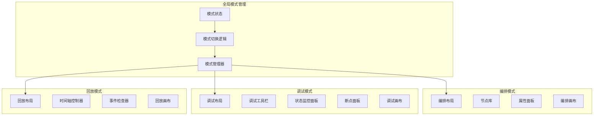

### 状态管理架构扩展

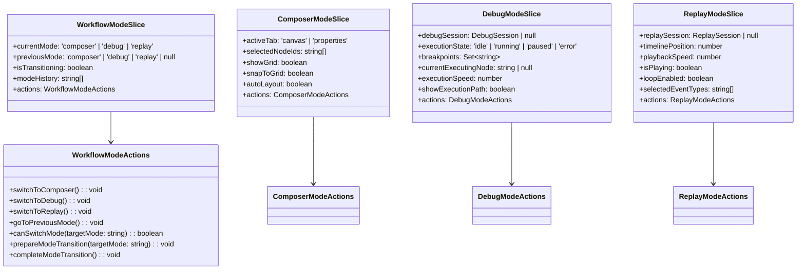

## UI设计与布局

### 主界面布局设计

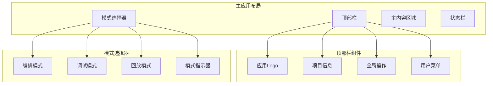

### 编排模式布局

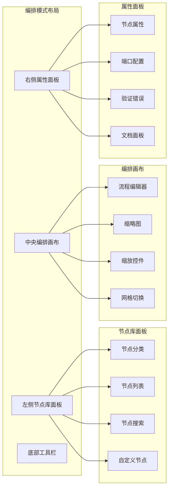

### 调试模式布局

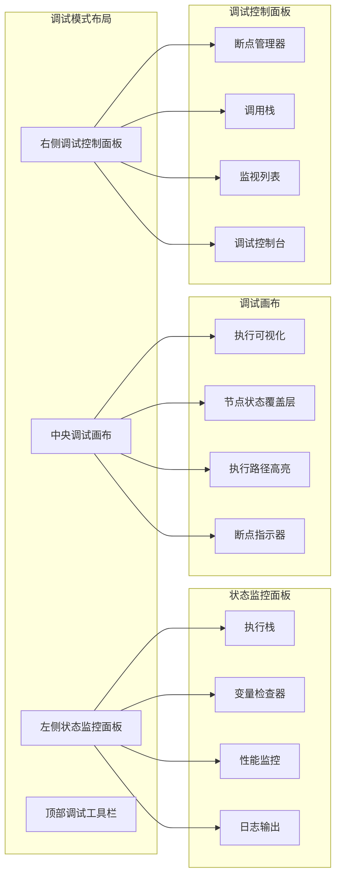

### 回放模式布局

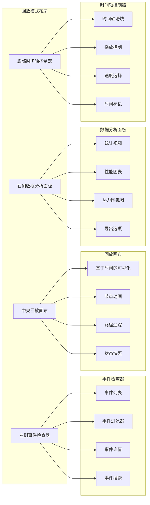

## 核心功能架构

### 编排模式功能架构

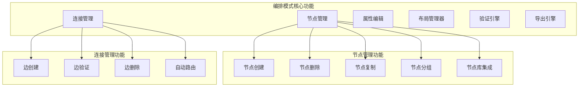

### 调试模式功能架构

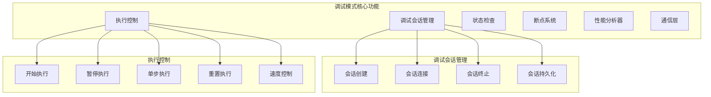

### 回放模式功能架构

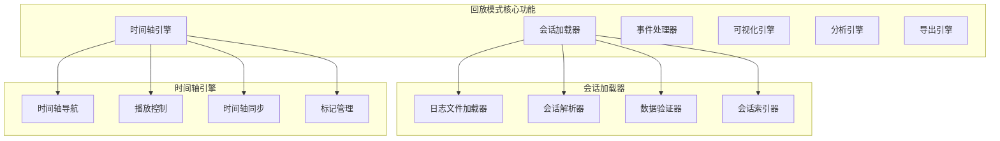

## 数据流设计

### 模式切换数据流

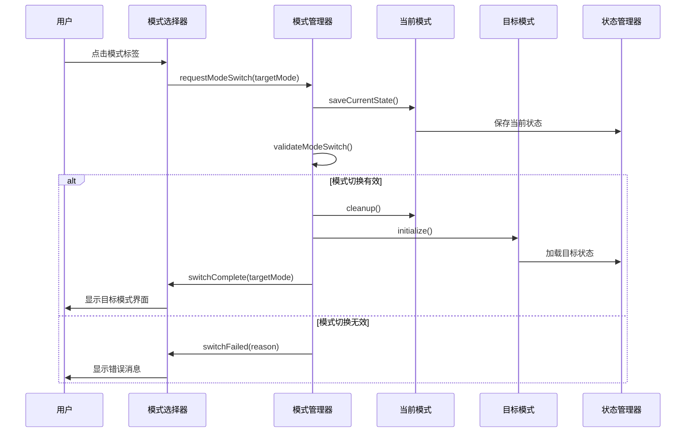

### 编排模式数据流

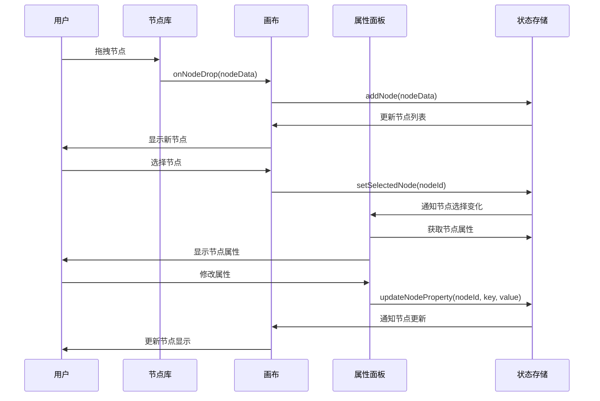

### 调试模式数据流

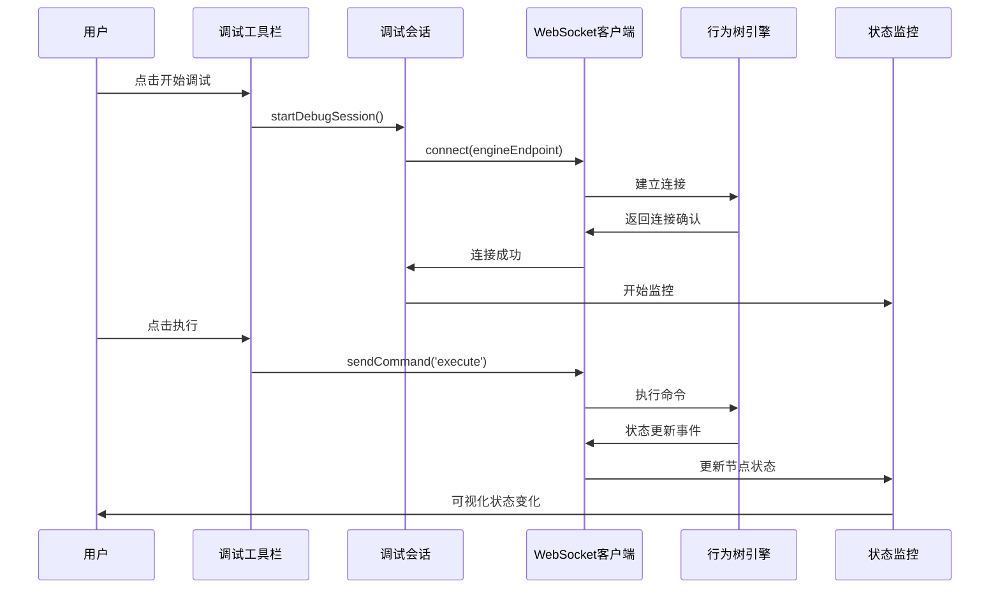

## 测试策略

### 模式切换测试
- 测试三种模式之间的平滑切换
- 验证状态保存和恢复的正确性
- 测试异常情况下的模式切换处理

### 组件集成测试
- 各模式下组件间的交互测试
- 数据流的端到端测试
- 性能和内存使用测试

### 用户体验测试
- 界面响应性测试
- 国际化功能测试
- 无障碍访问测试