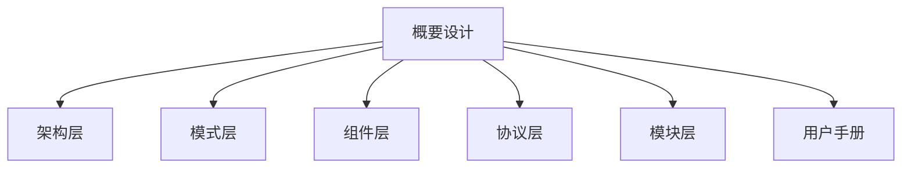

# BT Web Studio 概要设计

本文档是开发者入口，负责说明文档分层、核心架构边界与代码映射关系。

## 1. 目标与范围

- 目标：建立“可维护、可检索、可追踪”的文档体系。
- 范围：架构层、模式层、共享组件层、协议层、模块层。
- 非目标：替代代码注释；实现细节以 `src/` 为准。

## 2. 文档分层

## 3. 架构层

- [`架构/三模式架构.md`](./架构/三模式架构.md)：模式状态机、边界与职责。
- [`架构/状态管理与数据流.md`](./架构/状态管理与数据流.md)：Zustand slices、核心数据流。
- [`架构/UI布局与交互分层.md`](./架构/UI布局与交互分层.md)：`components/layout` 分层与交互职责。
- [`架构/迁移与里程碑.md`](./架构/迁移与里程碑.md)：迭代路线与验收标准。

## 4. 模式层

- [`模式/编排模式.md`](./模式/编排模式.md)
- [`模式/调试模式.md`](./模式/调试模式.md)
- [`模式/回放模式.md`](./模式/回放模式.md)

## 5. 组件层（共享）

- [`组件/顶部工具栏.md`](./组件/顶部工具栏.md)
- [`组件/属性面板.md`](./组件/属性面板.md)

## 6. 协议层

- [`协议/Groot2-协议总览.md`](./协议/Groot2-协议总览.md)
- [`协议/Groot2-命令手册-REQ-REP.md`](./协议/Groot2-命令手册-REQ-REP.md)
- [`协议/Groot2-事件手册-PUB-SUB.md`](./协议/Groot2-事件手册-PUB-SUB.md)
- [`协议/Groot2-错误码与状态枚举.md`](./协议/Groot2-错误码与状态枚举.md)
- [`协议/Groot2-实现示例.md`](./协议/Groot2-实现示例.md)

## 7. 模块层

- [`模块/core-bt.md`](./模块/core-bt.md)
- [`模块/core-store.md`](./模块/core-store.md)
- [`模块/core-debugger.md`](./模块/core-debugger.md)
- [`模块/core-layout.md`](./模块/core-layout.md)
- [`模块/components-layout.md`](./模块/components-layout.md)
- [`模块/hooks.md`](./模块/hooks.md)

## 8. 用户文档与研发文档

- 用户入口：[`用户手册.md`](./用户手册.md)
- 术语表：[`研发/术语表.md`](./研发/术语表.md)
- 文档规范：[`研发/文档编写规范.md`](./研发/文档编写规范.md)
- 产品调研：[`研发/需求-产品调研.md`](./研发/需求-产品调研.md)
- 部署指南：[`研发/部署指南.md`](./研发/部署指南.md)

## 9. 与代码映射

| 代码目录 | 主文档 |
|---|---|
| `src/core/bt` | `模块/core-bt.md` |
| `src/core/store` | `模块/core-store.md` |
| `src/core/debugger` | `模块/core-debugger.md` |
| `src/core/layout` | `模块/core-layout.md` |
| `src/components/layout` | `模块/components-layout.md` |
| `src/hooks` | `模块/hooks.md` |

## 10. 维护规则

- 代码结构变化时，同步更新“模块层”文档。
- 模式行为变化时，同步更新“模式层”和“组件层”文档。
- 协议字段变化时，必须同步更新“协议层”全部相关文档。
