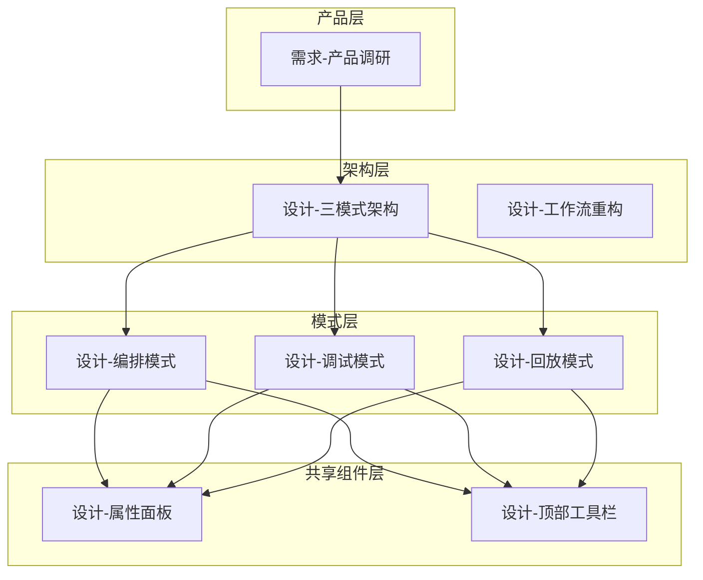

# BT Web Studio 概要设计

本文档为 docs 目录的入口，按层次索引所有设计、需求与协议文档。

## 1. 概述

- **设计文档**：7 份，覆盖架构、模式、组件
- **支撑文档**：需求调研、Groot2 协议
- **用户文档**：用户手册、示例 XML

## 2. 文档关系图

属性面板、顶部工具栏为**三模式共享**组件，编排/调试/回放模式共同引用；各模式有特化差异，详见各模式设计文档。

## 3. 架构层

| 文档 | 摘要 |
|------|------|
| [设计-三模式架构.md](设计-三模式架构.md) | 编排/调试/回放状态机、数据模型、时间轴、调试协议、迁移计划 |
| [设计-工作流重构.md](设计-工作流重构.md) | 模式管理、状态切片、三模式布局与数据流 |

## 4. 模式设计层

| 文档 | 摘要 |
|------|------|
| [设计-编排模式.md](设计-编排模式.md) | 编排目标、节点/边/端口模型、拖拽/连线/吸附、XML 导入导出、校验与路线图 |
| [设计-调试模式.md](设计-调试模式.md) | 五屏设计、设计风格、6 个实施里程碑 |
| [设计-回放模式.md](设计-回放模式.md) | 时间轴回放、轨道模型、Timeline Driver、书签与快照、4 个实施里程碑 |

## 5. 组件规范层（共享组件，各模式特化）

| 文档 | 摘要 |
|------|------|
| [设计-顶部工具栏.md](设计-顶部工具栏.md) | 三模式共享；模式驱动布局，文件/连接/加载/预览/设置/帮助显隐规则 |
| [设计-属性面板.md](设计-属性面板.md) | 三模式共享；五区划分、端口配置、Root 规则、模型驱动；编排侧重编辑，调试/回放侧重展示 |

## 6. 支撑文档

| 文档 | 摘要 |
|------|------|
| [需求-产品调研.md](需求-产品调研.md) | Groot1/2 对比、用户角色、功能与非功能需求 |
| [协议-Groot2通信.md](协议-Groot2通信.md) | ZMQ、REQ/REP、PUB/SUB、命令格式 |

## 7. 其他

| 文档 | 摘要 |
|------|------|
| [用户手册.md](用户手册.md) | 使用指南 |
| [demo.xml](demo.xml) | 示例 XML |

## 8. 推荐阅读顺序

1. 需求-产品调研 → 设计-三模式架构 → 设计-工作流重构
2. 设计-编排模式 → 设计-属性面板 → 设计-顶部工具栏
3. 设计-调试模式 → 设计-回放模式 → 协议-Groot2通信
